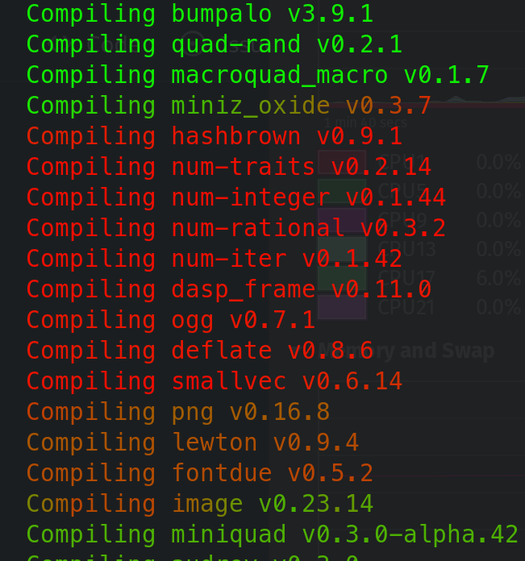

# CPU cat

`cat` program with coloring based on the cpu usage.

Intended for use with long-running processes (like `mvn package` or `cargo build`) to highlight hot places.

Example use:

    cargo build | cpucat

