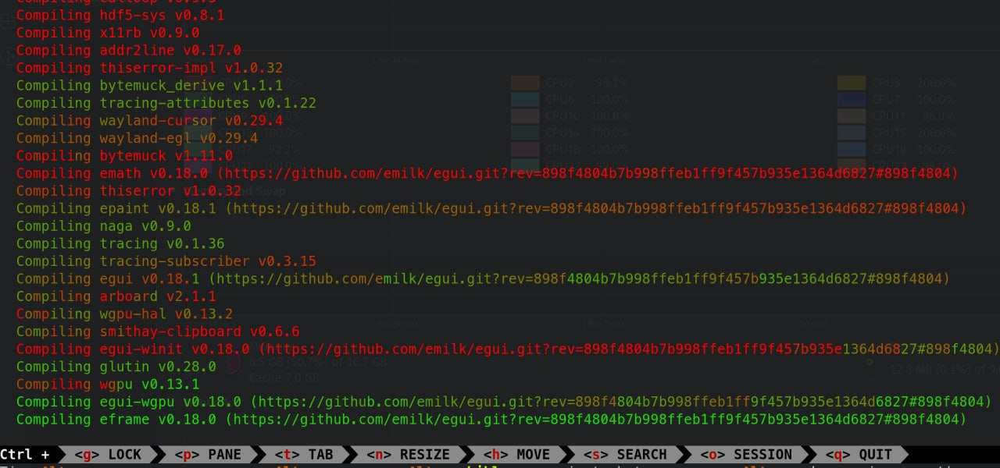

# CPU cat

`cat` program with output coloring based on the cpu usage.

Intended for use with long-running processes (like `mvn package`) to highlight hot places.

### Example use:

    cargo build | cpucat

### Installation

Simply build (`cargo build --release`) and copy the executable `cp target/release/cpucat /usr/bin`
